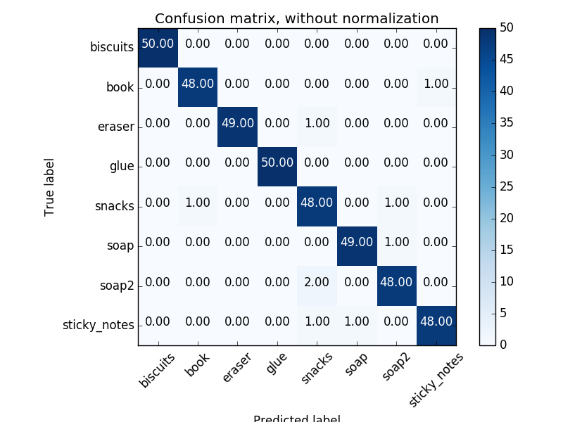
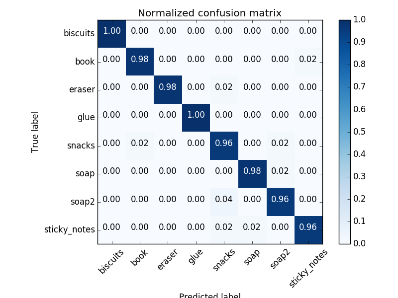
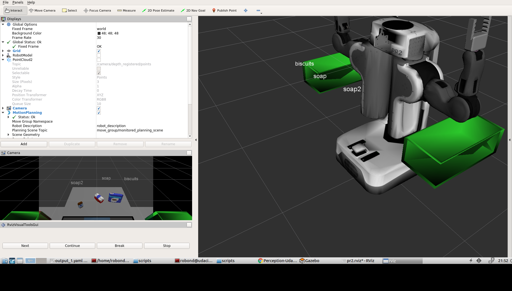
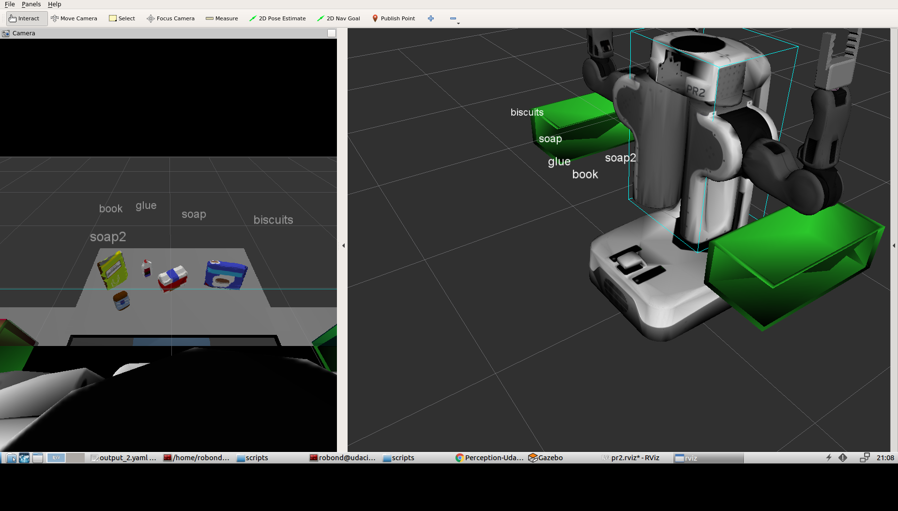
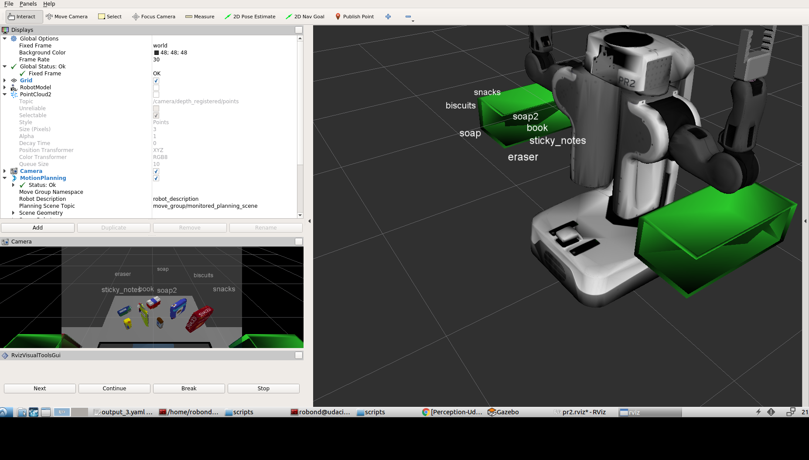

## Project: Perception Pick & Place
### Writeup Template: You can use this file as a template for your writeup if you want to submit it as a markdown file, but feel free to use some other method and submit a pdf if you prefer.

---

# Required Steps for a Passing Submission:
1. Extract features and train an SVM model on new objects (see `pick_list_*.yaml` in `/pr2_robot/config/` for the list of models you'll be trying to identify). 
2. Write a ROS node and subscribe to `/pr2/world/points` topic. This topic contains noisy point cloud data that you must work with.
3. Use filtering and RANSAC plane fitting to isolate the objects of interest from the rest of the scene.
4. Apply Euclidean clustering to create separate clusters for individual items.
5. Perform object recognition on these objects and assign them labels (markers in RViz).
6. Calculate the centroid (average in x, y and z) of the set of points belonging to that each object.
7. Create ROS messages containing the details of each object (name, pick_pose, etc.) and write these messages out to `.yaml` files, one for each of the 3 scenarios (`test1-3.world` in `/pr2_robot/worlds/`).  [See the example `output.yaml` for details on what the output should look like.](https://github.com/udacity/RoboND-Perception-Project/blob/master/pr2_robot/config/output.yaml)  
8. Submit a link to your GitHub repo for the project or the Python code for your perception pipeline and your output `.yaml` files (3 `.yaml` files, one for each test world).  You must have correctly identified 100% of objects from `pick_list_1.yaml` for `test1.world`, 80% of items from `pick_list_2.yaml` for `test2.world` and 75% of items from `pick_list_3.yaml` in `test3.world`.
9. Congratulations!  Your Done!

# Extra Challenges: Complete the Pick & Place
7. To create a collision map, publish a point cloud to the `/pr2/3d_map/points` topic and make sure you change the `point_cloud_topic` to `/pr2/3d_map/points` in `sensors.yaml` in the `/pr2_robot/config/` directory. This topic is read by Moveit!, which uses this point cloud input to generate a collision map, allowing the robot to plan its trajectory.  Keep in mind that later when you go to pick up an object, you must first remove it from this point cloud so it is removed from the collision map!
8. Rotate the robot to generate collision map of table sides. This can be accomplished by publishing joint angle value(in radians) to `/pr2/world_joint_controller/command`
9. Rotate the robot back to its original state.
10. Create a ROS Client for the “pick_place_routine” rosservice.  In the required steps above, you already created the messages you need to use this service. Checkout the [PickPlace.srv](https://github.com/udacity/RoboND-Perception-Project/tree/master/pr2_robot/srv) file to find out what arguments you must pass to this service.
11. If everything was done correctly, when you pass the appropriate messages to the `pick_place_routine` service, the selected arm will perform pick and place operation and display trajectory in the RViz window
12. Place all the objects from your pick list in their respective dropoff box and you have completed the challenge!
13. Looking for a bigger challenge?  Load up the `challenge.world` scenario and see if you can get your perception pipeline working there!

## [Rubric](https://review.udacity.com/#!/rubrics/1067/view) Points
### Here I will consider the rubric points individually and describe how I addressed each point in my implementation.  

---
### Writeup / README

#### 1. Provide a Writeup / README that includes all the rubric points and how you addressed each one.  You can submit your writeup as markdown or pdf.  

You're reading it!

### Exercise 1, 2 and 3 pipeline implemented
#### 1. Complete Exercise 1 steps. Pipeline for filtering and RANSAC plane fitting implemented.
In this part, PCL's StatisticalOutlierRemoval filter is first applied to noisy point cloud data, where the number of neighboring points to analyze is set to 20 and threshold scale factor as 0.1, then a Voxel Grid Downsampling Filter is used to derive a point cloud that has fewer points but should still do a good job of representing the input point cloud as a whole.  Pass Through Filter is created to select a region of interest to remove some of the excess data, and RANSAC Plane Segmentation to identify the table from the objects on it.
#### 2. Complete Exercise 2 steps: Pipeline including clustering for segmentation implemented.
To use PCL's Euclidean Clustering algorithm to segment objects, first construct a k-d tree from the cloud_objects point cloud, then extract indices for each of the discovered clusters.  For visualization, create new cloud containing all clusters, each with unique color, and a new publisher called /pcl_cluster for the cluster cloud.
#### 2. Complete Exercise 3 Steps.  Features extracted and SVM trained.  Object recognition implemented.
Here the sensor_stick model is used to analyze and record each object of the PR2 project.  After launching the Gazebo environment:

roslaunch sensor_stick training.launch

and running the script:

rosrun sensor_stick capture_features.py

the point cloud features will be saved in trainging_set.sav; to start training, run:

python train_svm.py

and save the final model to model.sav.  An accuracy of 98% (+/- 11%) is achieved, with a linear kernel and C = 0.1, shown in the following confusion matrix.

### Pick and Place Setup

#### 1. For all three tabletop setups (`test*.world`), perform object recognition, then read in respective pick list (`pick_list_*.yaml`). Next construct the messages that would comprise a valid `PickPlace` request output them to `.yaml` format.
Include object recognition code to perception pipeline, then test with the actual project scene to see if recognition code is sucessful.  After running:

roslaunch pr2_robot pick_place_project.launch

and

rosrun pr2_robot project-template.py

in three different scenarios, output_1.yaml, output_2.yaml, and output_3.yaml are generated, and correponding screenshots are displayed below.

For test1.world, 100% (3/3) objects are correctly identified; test2.world, 100% (5/5) identified; but for test3.world, only 87.5% (7/8) are correctly identified, because glue is blocked by book.  The performance of object recognition can be improved by training a CNN model of deep learning.
